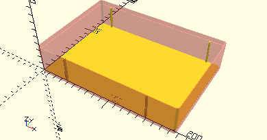
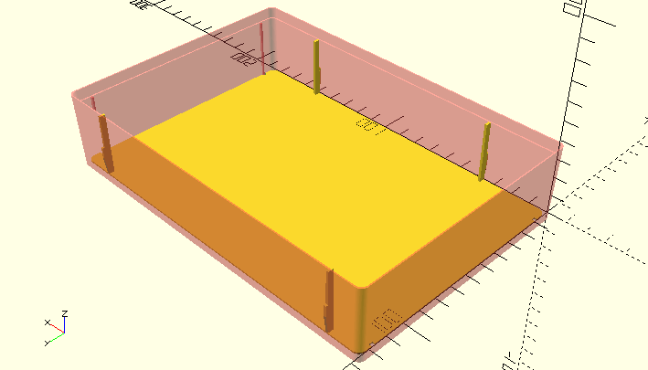

# Box190Inlay

Erzeugt eine Bodenplatte für Elemente, die i8n eine vorhandene Box 190 x 130 mm des Sortierkastens 1000 gelegt werden kann.



__Box190Inlay__ dient als Basisplatte für das Platzieren von Elementen. Dies soll eine Alternative zum Komplettdruck eines Kastens mit [__Box190__](Box190.md) sein. Wenn solche Kästen vorhanden sind, reicht der Druck der Bodenplatte mit den platzierten Elementen.

Die Bodenplatte kann mithilfe von [Box190InlayWeb](Box190InlayWeb.md) erzeugten Stegen in den Kasten eingerastet werden. Die Kästen haben für die Trennwände Ausparungen. Die Stege werden so platziert, dass sie immer in eine der Ausparungen einrasten können. Im Bild oben sind vier solcher Stege zu sehen.

Die Bodenplatten haben abgerundete Ecken, damit sie in die Kästen passen.

## Use
```
use <../../Base/BoxInlays.scad>
```

## Syntax
```
Box190Inlay();
```

## Beispiel
```
use <../../Base/Boxes.scad>
use <../../Base/BoxInlays.scad>

include <../../Base/PlacementOptions.scad>

translate([0,0,-0.8])
    #Box190();
Box190Inlay();

Box190InlayWeb(AlignBottom, 1);
Box190InlayWeb(AlignBottom, 7);

Box190InlayWeb(AlignTop, 0);
Box190InlayWeb(AlignTop, 8);
```

Die rot-transparente Box zeigt, wie der Einsatz im Kasten platziert wird. Der Boden hat eine Stärke von 0,8 mm. Deswegen wird hier im Beispiel die Box um 0,8 m abgesenkt, damit die Platte im 3D-Modell auf dem Boden des Kastens aufliegt.

Die vier [__Box190InlayWeb__](Box190InlayWeb.md)-Aufrufe platzieren Stege an den Seiten, die in den Aussparungen des Sortierkastens einrasten.


