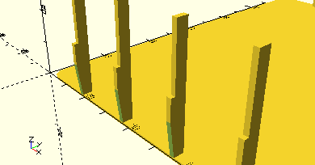
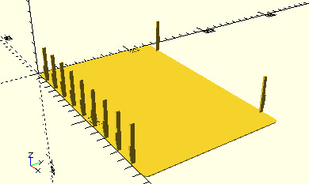

# Box190InlayWeb

Erzeugt einen Steg für [__Box190Inlay__](Box190Inlay.md)-Bodenplatten für die Kästen 190 x 130 mm des Sortierkastens 1000. Diesse Stege können zum Einschnappen der Bodenplatte in die Aussparungen für die Trenner des Kastens verwendet werden, damit die Platte stabil im Kasten bleibt.



## Use
```
use <../../Base/BoxInlays.scad>

include <../../Base/PlacementOptions.scad>
```

## Syntax
```
Box190InlayWeb(
    align,
    position,
    inlayWebDepth=3
);
```

| Parameter | Typ | Beschreibung |
| ------ | ------ | ------ |
| align | Integer (Enum) | __AlignBottom__ wenn der Steg an der vorderen Wand platziertwwerden soll (niedrige Y-Position, __AlignTop__ für Stege an der hinteren Wand (höhere Y-Position). |
| position | Integer | Index des Stegs, beginnend bei 0 ganz links bis 8 ganz rechts. Die Positionen sind ausgerichtet auf die Aussparungen des Sortierkastens aus der Box 1000. |
| inlayWebDepth | Decimal | Tiefe des Stegs, wie weit dieser in den Kasten hineinragt. Standard ist 3 mm oben am Rand. |

## Beispiel
```
use <../../Base/Boxes.scad>
use <../../Base/BoxInlays.scad>

include <../../Base/PlacementOptions.scad>

Box190Inlay();

Box190InlayWeb(AlignBottom, 0);
Box190InlayWeb(AlignBottom, 1);
Box190InlayWeb(AlignBottom, 2);
Box190InlayWeb(AlignBottom, 3);
Box190InlayWeb(AlignBottom, 4);
Box190InlayWeb(AlignBottom, 5);
Box190InlayWeb(AlignBottom, 6);
Box190InlayWeb(AlignBottom, 7);
Box190InlayWeb(AlignBottom, 8);

Box190InlayWeb(AlignTop, 0);
Box190InlayWeb(AlignTop, 8);
```

Im vorderen Bereich werden alle möglichen Positionen von 0 bis 9 besetzt.

