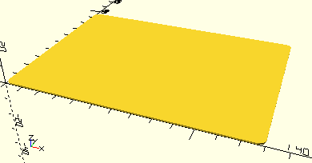

# RoundedCornerPlate

Erzeugt eine Platte mit abgerundeten Ecken. Das Modul wird auch intern zur Konstruktion von Sortierkästen und Sortiereinsätzen verwendet.



## Use
```
use <../Base/Boxes.scad>
```

## Syntax
```
RoundedCornerPlate(
    width,
    depth,
    height,
    radius);
```

| Parameter | Typ | Beschreibung |
| ------ | ------ | ------ |
| width | Decimal | Breite der Platte. Für Einsätze müssen die Maße der Bodenplatte und eine Toleranz berücksichtigt werden. __BodyPlate__ nimmt exakt die übergebenen Werte. |
| depth | Decimal | Tiefe der Platte. Für Einsätze müssen die Maße der Bodenplatte und eine Toleranz berücksichtigt werden. __BodyPlate__ nimmt exakt die übergebenen Werte. |
| height | Decimal | Dicke der Platte. |
| radius | Decimal | Radius der Ecken. |