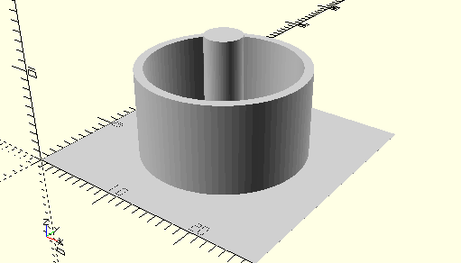

# AxisAndCylinderIdlerGearZ15
Zahnrad Z15.
- 35695



Alternativ gibt es auch das Element [AxisIdlerGearZ15](AxisIdlerGearZ15.md), das nur aus einer abgestufte Achse besteht. __AxisAndCylinderIdlerGearZ15__ wird so im Kasten mot3 innerhalb des Innenzahnrads verwendet, __AxisIdlerGearZ15__ in mot2.

## Use
```
use <../Elements/AxisAndCylinderIdlerGearZ15.scad>
```

## Syntax
```
AxisAndCylinderIdlerGearZ15();

space = getAxisAndCylinderIdlerGearZ15Space();
```

## Rückgabewert getAxisAndCylinderIdlerGearZ15Space
Fläche als \[x,y]-Liste