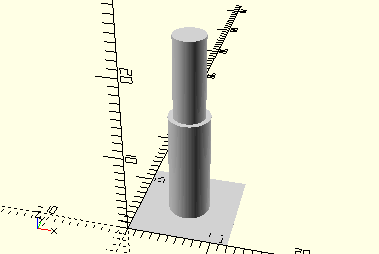

# AxisClip10
Klemmbuchse 10.
- 31023



3D-Druck getestet mit 12 und 23 mm Höhe

## Use
```
use <../Elements/AxisClip10.scad>
```

## Syntax
```
AxisClip10(
    height=23,
    clipHeight=10
);

space = getAxisClip10Space();
```

| Parameter | Typ | Beschreibung |
| ------ | ------ | ------ |
| height | Decimal | Gesamthöhe der Achse. In mot2 sind dies 23 mm (hier Standard), in mot3 nur 12 mm. Bei dem Wert sollte die Umgebung berücksichtigt werden, wie gut man noch an die Buchse herankommt. |
| clipHeight | Decimal | Höhe des dünneren teils der Achse, auf den die Buchse aufgesteckt wird. In mot2 sind dies die vollen 10 mm (hier Standard), in mot3 nur 7 mm.  |

## Rückgabewert getAxisClip10Space
Fläche als \[x,y]-Liste
