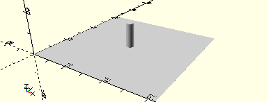

# AxisFlatHubWithGearZ40
Zahnrad Z40 mit Flachnabe.
- 31015
- 31022



Nur in Verbindung mit einer Flachnabe, die auf die Achse gesteckt wird. Die Seite mit den drei Abstandshaltern am Zahnrad Z40 muss unten sein, wie im Kasten 50/2.

## Use
```
use <../Elements/AxisFlatHubWithGearZ40.scad>
```

## Syntax
```
AxisFlatHubWithGearZ40();

space = getAxisFlatHubWithGearZ40Space();
```

## Rückgabewert getAxisFlatHubWithGearZ40Space
Fläche als \[x,y]-Liste