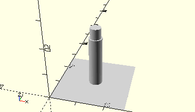

# AxisIdlerGearZ15
Zahnrad Z15.

- 35695



## Use
```
use <../Elements/AxisIdlerGearZ15.scad>
```

## Syntax
```
AxisIdlerGearZ15();

space = getAxisIdlerGearZ15Space();
```

## Rückgabewert getAxisIdlerGearZ15Space
Fläche als \[x,y]-Liste