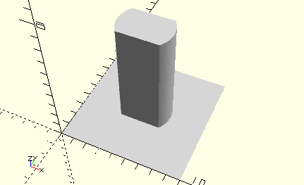

# AxisLockingAxisCoupling
Rastachsenkupplung stehend.
- 35073



## Use
```
use <../Elements/AxisLockingAxisCoupling.scad>
```

## Syntax
```
AxisLockingAxisCoupling();

space = getAxisLockingAxisCouplingSpace();
```

## Rückgabewert getAxisLockingAxisCouplingSpace
Fläche als \[x,y]-Liste