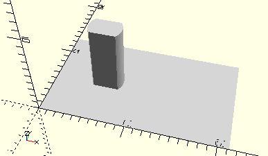

# AxisLockingCrank
Rastkurbel.
- 35088



## Use
```
use <../Elements/AxisLockingCrank.scad>
```

## Syntax
```
AxisLockingCrank();

space = getAxisLockingCrankSpace();
```

## Rückgabewert getAxisLockingCrankSpace
Fläche als \[x,y]-Liste