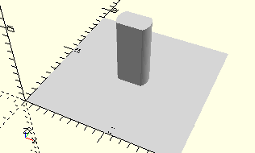

# AxisLockingGear10
Rastzahnrad 10 (stehend).
- 35945



3D-Druck getestet.

## Use
```
use <../Elements/AxisLockingGear10.scad>
```

## Syntax
```
AxisLockingGear10();

space = getAxisLockingGear10Space();
```

## Rückgabewert getAxisLockingGear10Space
Fläche als \[x,y]-Liste