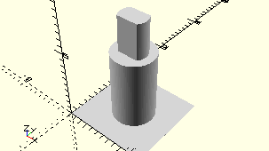

# AxisLockingPulley12
Rastseilrolle 12.
- 136775



## Use
```
use <../Elements/AxisLockingPulley12.scad>
```

## Syntax
```
AxisLockingPulley12();

space = getAxisLockingPulley12Space();
```

## Rückgabewert getAxisLockingPulley12Space
Fläche als \[x,y]-Liste