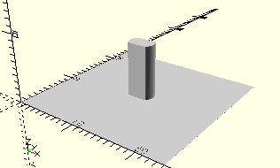

# AxisLockingWorm
Rastschnecke (stehend).
- 35072



## Use
```
use <../Elements/AxisLockingWorm.scad>
```

## Syntax
```
AxisLockingWorm();

space = getAxisLockingWormSpace();
```

## Rückgabewert getAxisLockingWormSpace
Fläche als \[x,y]-Liste