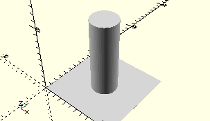

# AxisPropellerTip
Propellerspitze.
- 37681



## Use
```
use <../Elements/AxisPropellerTip.scad>
```

## Syntax
```
AxisPropellerTip();

space = getAxisPropellerTipSpace();
```

## Rückgabewert getAxisPropellerTipSpace
Fläche als \[x,y]-Liste