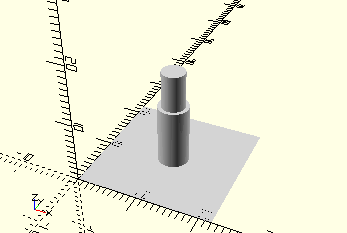

# AxisPulley
Seilrolle.
- 35795



Achse zum Aufstecken einer Seilrolle wie im Baukasten 50/1.

## Use
```
use <../Elements/AxisPulley.scad>
```

## Syntax
```
AxisPulley();

space = getAxisPulleySpace();
```

## Rückgabewert getAxisPulleySpace
Fläche als \[x,y]-Liste