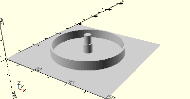

# ComboFlatHubLargePulleyWheel
Drehscheibe mit montierter Flachnabe.
- 31015
- 31019



## Use
```
use <../Elements/ComboFlatHubLargePulleyWheel.scad>
```

## Syntax
```
ComboFlatHubLargePulleyWheel(
    height=10);

space = get$ComboFlatHubLargePulleyWheelSpace();
```

| Parameter | Typ | Beschreibung |
| ------ | ------ | ------ |
| height | Decimal | Höhe der Achse. Der Stützring ist 5 mm niedriger. Bei *height* = 5 oder kleiner wird kein Stützring mehr erzeugt. |

## Rückgabewert getComboFlatHubLargePulleyWheelSpace
Fläche als \[x,y]-Liste