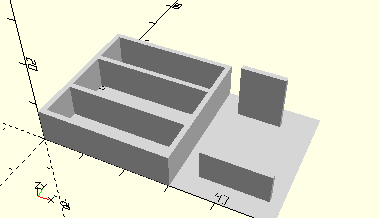

# ComboFrameBrackets
Kombination für die beiden Lager mit und ohne Schnecke für den 6V-Motor.
- 31045
- 31046

Die Elemente gibt es auch separat: [FrameBracketWithoutWorm](FrameBracketWithoutWorm.md) und [FrameBracketWithWorm](FrameBracketWithWorm.md). Im Kasten mot1 sind diese beiden Elemente über Wände zu einer Kombination verbunden.



## Use
```
use <../Elements/ComboFrameBrackets.scad>
```

## Syntax
```
ComboFrameBrackets();

space = getComboFrameBracketsSpace();
```

## Rückgabewert getComboFrameBracketsSpace
Fläche als \[x,y]-Liste