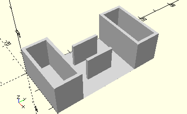

# ComboHolderWinchDrumWithLockingRings
Seiltrommel mit zwei Klemmringen.
- 31016
- 31020



## Use
```
use <../Elements/ComboHolderWinchDrumWithLockingRings.scad>
```

## Syntax
```
ComboHolderWinchDrumWithLockingRings();

space = getComboHolderWinchDrumWithLockingRingsSpace();
```

## Rückgabewert getComboHolderWinchDrumWithLockingRingsSpace
Fläche als \[x,y]-Liste