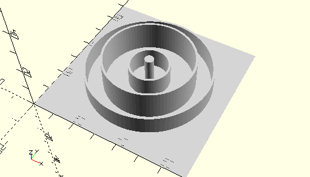

# ComboInnerGearWheelAndIdlerGearZ15
Kombination für Innenzahnrad und Zahrad Z15.
- 35694
- 35695



## Use
```
use <../Elements/ComboInnerGearWheelAndIdlerGearZ15.scad>
```

## Syntax
```
ComboInnerGearWheelAndIdlerGearZ15();

space = getComboInnerGearWheelAndIdlerGearZ15Space();
```

## Rückgabewert getComboInnerGearWheelAndIdlerGearZ15Space
Fläche als \[x,y]-Liste