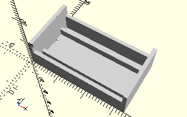

# ComboLockingWinchDrumAndHolder
Rastseilwinde 30 montiert mit Halterung.
- 35069
- 35070



3D-Druck getestet.

## Use
```
use <../Elements/ComboLockingWinchDrumAndHolder.scad>
```

## Syntax
```
ComboLockingWinchDrumAndHolder();

space = getComboLockingWinchDrumAndHolderSpace();
```

## Rückgabewert getComboLockingWinchDrumAndHolderSpace
Fläche als \[x,y]-Liste