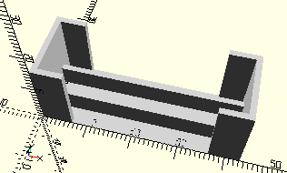

# ComboWormAndNutScrew
Antriebsschnecke mit Mutter montiert (liegend).
- 31915
- 37438



## Use
```
use <../Elements/ComboWormAndNutScrew.scad>
```

## Syntax
```
ComboWormAndNutScrew();

space = getComboWormAndNutScrewSpace();
```

## Rückgabewert getComboWormAndNutScrewSpace
Fläche als \[x,y]-Liste