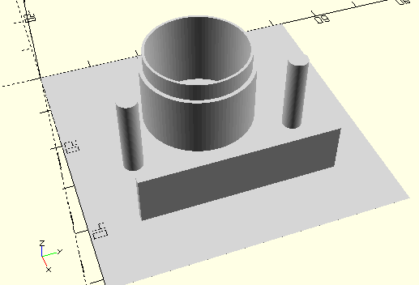

# CylinderAndAxisSegmentDisc
Segmentscheibe.
- 31037



## Use
```
use <../Elements/CylinderAndAxisSegmentDisc.scad>
```

## Syntax
```
CylinderAndAxisSegmentDisc();

space = getCylinderAndAxisSegmentDiscSpace();
```

## Rückgabewert getCylinderAndAxisSegmentDiscSpace
Fläche als \[x,y]-Liste