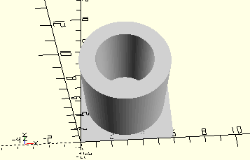

# CylinderClipContact
Klemmkontakt (wie in mini-mot 1).
- 31338



## Use
```
use <../Elements/CylinderClipContact.scad>
```

## Syntax
```
CylinderClipContact();

space = getCylinderClipContactSpace();
```

## Rückgabewert getCylinderClipContactSpace
Fläche als \[x,y]-Liste