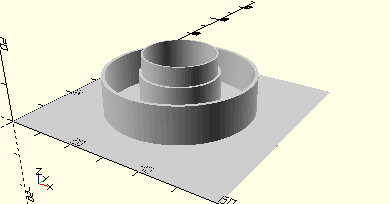

# CylinderLargePulleyWheel
Drehscheibe.
- 31019



Drehscheibe ohne Nabe.

## Use
```
use <../Elements/CylinderLargePulleyWheel.scad>
```

## Syntax
```
CylinderLargePulleyWheel();

space = getCylinderLargePulleyWheelSpace();
```

## Rückgabewert getCylinderLargePulleyWheelSpace
Fläche als \[x,y]-Liste