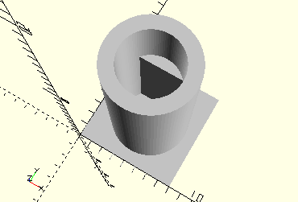

# CylinderLockingAxis30
Rastachse 30 stehend.
- 35063



## Use
```
use <../Elements/CylinderLockingAxis30.scad>
```

## Syntax
```
CylinderLockingAxis30();

space = getCylinderLockingAxis30Space();
```

## Rückgabewert getCylinderLockingAxis30Space
Fläche als \[x,y]-Liste