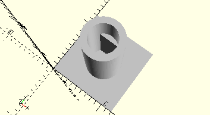

# CylinderLockingBevelGear
Rastachse mit Kegelzahnrad.
- 35061



## Use
```
use <../Elements/CylinderLockingBevelGear.scad>
```

## Syntax
```
CylinderLockingBevelGear();

space = getCylinderLockingBevelGearSpace();
```

## Rückgabewert getCylinderLockingBevelGearSpace
Fläche als \[x,y]-Liste