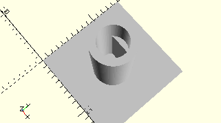

# CylinderLockingGearZ28
Rastachse mit Getriebezahnrad Z28 für Mini-Motor-Stufengetriebe.
- 31082



## Use
```
use <../Elements/CylinderLockingGearZ28.scad>
```

## Syntax
```
CylinderLockingGearZ28();

space = getCylinderLockingGearZ28Space();
```

## Rückgabewert getCylinderLockingGearZ28Space
Fläche als \[x,y]-Liste