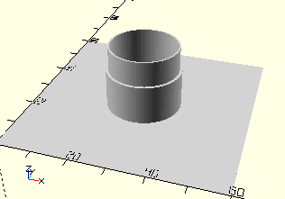

# CylinderOmniWheel
Montiertes Omniwheel.
- 183025
- 183026
- 183027
- 183028



## Use
```
use <../Elements/CylinderOmniWheel.scad>
```

## Syntax
```
CylinderOmniWheel();

space = getCylinderOmniWheelSpace();
```

## Rückgabewert getCylinderOmniWheelSpace
Fläche als \[x,y]-Liste