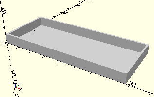

# Frame9VBatterySet
Batteriekasten für 9V-Block mit Polwendeschalter (wie im Motor Set XS).
- 135719



## Use
```
use <../Elements/Frame9VBatterySet.scad>
```

## Syntax
```
Frame9VBatterySet();

space = getFrame9VBatterySetSpace();
```

## Rückgabewert getFrame9VBatterySetSpace
Fläche als \[x,y]-Liste