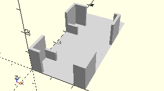

# Frame9VMiniMotor
Mini-Motor 9V.
- 32293



Auf der Seite liegend, Anschlüsse links.

## Use
```
use <../Elements/Frame9VMiniMotor.scad>
```

## Syntax
```
Frame9VMiniMotor();

space = getFrame9VMiniMotorSpace();
```

## Rückgabewert getFrame9VMiniMotorSpace
Fläche als \[x,y]-Liste