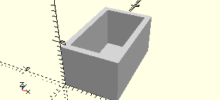

# FrameAngle15
Winkelstein 15° hochkant.
- 31981



## Use
```
use <../Elements/FrameAngle15.scad>
```

## Syntax
```
FrameAngle15();

space = getFrameAngle15Space();
```

## Rückgabewert getFrameAngle15Space
Fläche als \[x,y]-Liste