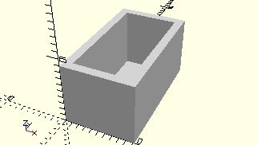

# FrameAngle7p5
Winkelstein 7,5° hochkant.
- 32071



## Use
```
use <../Elements/FrameAngle7p5.scad>
```

## Syntax
```
FrameAngle7p5();

space = getFrameAngle7p5Space();
```

## Rückgabewert getFrameAngle7p5Space
Fläche als \[x,y]-Liste