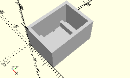

# FrameAngleBlock10x15x15
Winkelstein 10x15x15.
- 38423


Bei *single* = __true__ erzeugt das Modul für die angegebene Anzahl Bausteine eine Reihe von Rahmen, die durch Wände voneinander getrennt sind. Die Bauteile werden an der langen Seite hintereinander angeordnet.


Bei *single* = __false__ werden die Bausteine nicht durch Wände getrennt und mit dem Zapfen nach unten platziert. Diese Variante (__false__ ist Standard) benötigt weniger Fläche und ist bei einer höheren Zahl Bausteine zu empfehlen.



3D-Druck getestet

## Use
```
use <../Elements/FrameAngleBlock10x15x15.scad>
```

## Syntax
```
FrameAngleBlock10x15x15(
    count=1,
    single=false);

space = getFrameAngleBlock10x15x15Space(
    count=1,
    single=false);
```

| Parameter | Typ | Beschreibung |
| ------ | ------ | ------ |
| count | Integer | Anzahl der Bausteine. |
| single | Boolean | __true__, wenn die Bausteine durch Wände getrennt werden und mit der flachen Seite nach unten platziert werden. __false__ (Standard), wenn die Bausteine mit den Zapfen nach unten platziert werden und keine Zwischenwände erzeugt werden. |

## Rückgabewert getFrameAngleBlock10x15x15Space
Fläche als \[x,y]-Liste

## Beispiele

### single=true
```
use <../Elements/FrameAngleBlock10x15x15.scad>

count = 3;
single = true;
FrameAngleBlock10x15x15(count, single);
```


### single=false
```
use <../Elements/FrameAngleBlock10x15x15.scad>

count = 3;
single = false;
FrameAngleBlock10x15x15(count, single);
```


