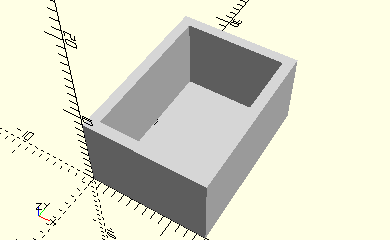

# FrameAngleRight
Rechtwikliger Winkelstein.
- 31012



## Use
```
use <../Elements/FrameAngleRight.scad>
```

## Syntax
```
FrameAngleRight(
    count);

space = getFrameAngleRightSpace(
    count);
```

| Parameter | Typ | Beschreibung |
| ------ | ------ | ------ |
| count | Integer | Anzahl der Winkelsteine. |

## Rückgabewert getFrameAngleRightSpace
Fläche als \[x,y]-Liste