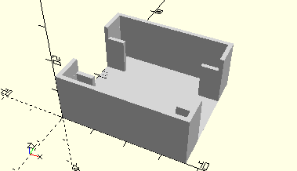

# FrameAperture
Loch-, Schlitz- oder Kreuzblende.
- 31371
- 31372
- 31373



## Use
```
use <../Elements/FrameAperture.scad>
```

## Syntax
```
FrameAperture();

space = getFrameApertureSpace();
```

## Rückgabewert getFrameApertureSpace
Fläche als \[x,y]-Liste