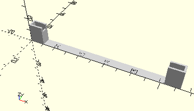

# FrameAxis110
Achse 110.
- 31031



## Use
```
use <../Elements/FrameAxis110.scad>
```

## Syntax
```
FrameAxis110(count=1);

space = getFrameAxis110Space(count=1);
```

| Parameter | Typ | Beschreibung |
| ------ | ------ | ------ |
| count | Integer | Anzahl der Achsen. |

## Rückgabewert getFrameAxis110Space
Fläche als \[x,y]-Liste