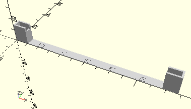

# FrameAxis125
Achse 125.
- 31036



## Use
```
use <../Elements/FrameAxis125.scad>
```

## Syntax
```
FrameAxis125(count=1);

space = getFrameAxis125Space(count=1);
```

| Parameter | Typ | Beschreibung |
| ------ | ------ | ------ |
| count | Integer | Anzahl der Achsen. |

## Rückgabewert getFrameAxis125Space
Fläche als \[x,y]-Liste