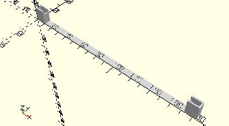

# FrameAxis180
Rastachse 180.
- 37527



## Use
```
use <../Elements/FrameAxis180.scad>
```

## Syntax
```
FrameAxis180(
    count=1);

space = get$FrameAxis180Space(
    count=1);
```

| Parameter | Typ | Beschreibung |
| ------ | ------ | ------ |
| count | Integer | Anzahl der Achsen. |

## Rückgabewert getFrameAxis180Space
Fläche als \[x,y]-Liste