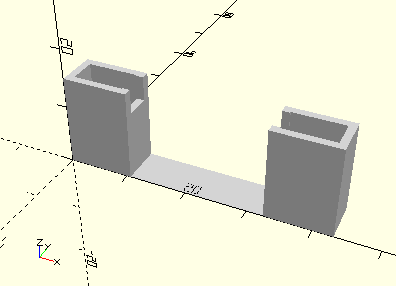

# FrameAxis40
Achse 40 oder Kunststoffachse 40.
- 38314
- 38414



## Use
```
use <../Elements/FrameAxis40.scad>
```

## Syntax
```
FrameAxis40(count=1);

space = getFrameAxis40Space(count=1);
```

| Parameter | Typ | Beschreibung |
| ------ | ------ | ------ |
| count | Integer | Anzahl der Achsen. |

## Rückgabewert getFrameAxis40Space
Fläche als \[x,y]-Liste