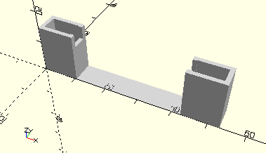

# FrameAxis50
Achse 50.
- 31033
- 38315 (alt, Kunststoffachse 50 grau)
- 38415



## Use
```
use <../Elements/FrameAxis50.scad>
```

## Syntax
```
FrameAxis50(count=1);

space = getFrameAxis50Space(count=1);
```

| Parameter | Typ | Beschreibung |
| ------ | ------ | ------ |
| count | Integer | Anzahl der Achsen. |

## Rückgabewert getFrameAxis50Space
Fläche als \[x,y]-Liste