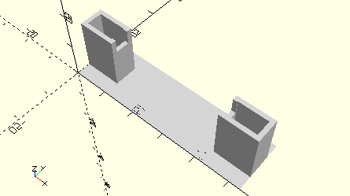

# FrameAxis50WithGearwheelZ28
Achse 50 mit Zahnrad Z28 für Minimotor-Getriebe.
- 185849



## Use
```
use <../Elements/FrameAxis50WithGearwheelZ28.scad>
```

## Syntax
```
FrameAxis50WithGearwheelZ28();

space = getFrameAxis50WithGearwheelZ28Space();
```

## Rückgabewert getFrameAxis50WithGearwheelZ28Space
Fläche als \[x,y]-Liste