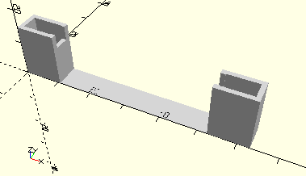

# FrameAxis60
Achse 60.
- 32032
- 38316 (alt, Kunststoffachse 60 grau)
- 38416



## Use
```
use <../Elements/FrameAxis60.scad>
```

## Syntax
```
FrameAxis60(count=1);

space = getFrameAxis60Space(count=1);
```

| Parameter | Typ | Beschreibung |
| ------ | ------ | ------ |
| count | Integer | Anzahl der Achsen. |

## Rückgabewert getFrameAxis60Space
Fläche als \[x,y]-Liste