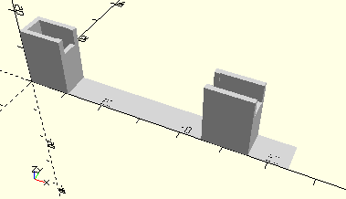

# FrameAxis60Open
Achse 60.
- 31032



Der Rahmen ist offen, so dass z.B. eine längere Achse eingelegt werden kann. Siehe Kasten mot1.

## Use
```
use <../Elements/FrameAxis60Open.scad>
```

## Syntax
```
FrameAxis60Open();

space = getFrameAxis60OpenSpace();
```

## Rückgabewert getFrameAxis60OpenSpace
Fläche als \[x,y]-Liste