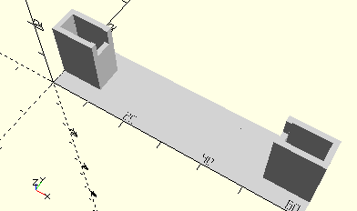

# FrameAxis60WithGearwheelZ28
Achse 60 mit Zahnrad Z 28 für Minimotor-Getriebe..
- 31063



## Use
```
use <../Elements/FrameAxis60WithGearwheelZ28.scad>
```

## Syntax
```
FrameAxis60WithGearwheelZ28();

space = getFrameAxis60WithGearwheelZ28Space();
```

## Rückgabewert getFrameAxis60WithGearwheelZ28Space
Fläche als \[x,y]-Liste