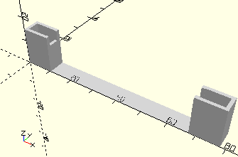

# FrameAxis75
Rastachse 75.
- 35087



## Use
```
use <../Elements/FrameAxis75.scad>
```

## Syntax
```
FrameAxis75(
    count=1);

space = get$FrameAxis75Space(
    count=1);
```

| Parameter | Typ | Beschreibung |
| ------ | ------ | ------ |
| count | Integer | Anzahl der Achsen. |

## Rückgabewert getFrameAxis75Space
Fläche als \[x,y]-Liste