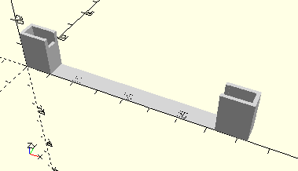

# FrameAxis80
Achse 80.
- 37384



## Use
```
use <../Elements/FrameAxis80.scad>
```

## Syntax
```
FrameAxis80();

space = getFrameAxis80Space();
```

## Rückgabewert getFrameAxis80Space
Fläche als \[x,y]-Liste