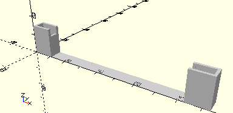

# FrameAxis90
Achse 90.
- 31040



## Use
```
use <../Elements/FrameAxis90.scad>
```

## Syntax
```
FrameAxis90();

space = getFrameAxis90Space();
```

## Rückgabewert getFrameAxis90Space
Fläche als \[x,y]-Liste