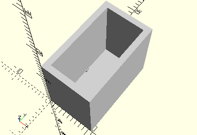

# FrameBlock15x30x5
Baustein 15x30x5 mit einem Zapfen.
- 35049



## Use
```
use <../Elements/FrameBlock15x30x5.scad>
```

## Syntax
```
FrameBlock15x30x5();

space = getFrameBlock15x30x5Space();
```

## Rückgabewert getFrameBlock15x30x5Space
Fläche als \[x,y]-Liste