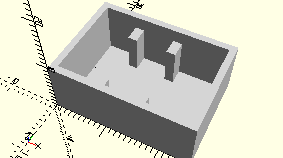

# FrameBlock5
Baustein 5 mit einem Zapfen.
- 37237
- 37468



Die Abbildung zeigt ein Beispiel für 3 Bausteine 5. Es werden ab einer Zahl größer 1 automatisch Trenner eingefügt, damit die Steine nicht kippen.

3D-Druck getestet.

## Use
```
use <../Elements/FrameBlock5.scad>
```

## Syntax
```
FrameBlock5(
    count=1);

space = get$FrameBlock5Space(
    count=1);
```

| Parameter | Typ | Beschreibung |
| ------ | ------ | ------ |
| count | Integer | Anzahl der Bausteine 5. |

## Rückgabewert getFrameBlock5Space
Fläche als \[x,y]-Liste