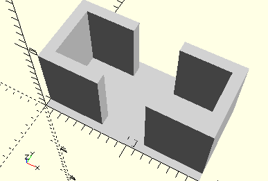
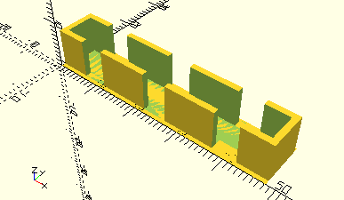

# FrameBlock5TwoPins
Baustein 5 mit zwei Zapfen.
- 37238



## Use
```
use <../Elements/FrameBlock5TwoPins.scad>
```

## Syntax
```
FrameBlock5TwoPins(
    count=1);

space = get$FrameBlock5TwoPinsSpace(
    count=1);
```

| Parameter | Typ | Beschreibung |
| ------ | ------ | ------ |
| count | Integer | Anzahl der Bausteine nebeneinander |

## Rückgabewert getFrameBlock5TwoPinsSpace
Fläche als \[x,y]-Liste

## Beispiel

```
use <../../Elements/FrameBlock5TwoPins.scad>

count=3;
FrameBlock5TwoPins(count);
```

