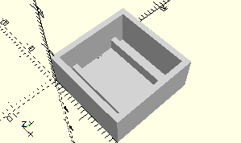

# FrameBlockWithStud

Bausteine mit Zapfen nach unten.

- 31006
- 31007
- 32882
- 36298
- 36304
- 36922
- 36950
- 37636
- 38240
- 139645



Der Rahmen hat am Boden zwei Stege, so dass der Zapfen dazwischen Platz hat.

## Use
```
use <../Elements/FrameBlockWithStud.scad>
```

## Syntax
```
FrameBlockWithStud(
    count=1, 
    height=8);

space = getFrameBlockWithStudSpace()
    count=1);
```

| Parameter | Typ | Beschreibung |
| ------ | ------ | ------ |
| count | Integer | Anzahl der Bausteine nebeneinander (X-Richtung). |
| height | Decimal | Höhe der Wände in mm. |

## Rückgabewert getFrameBlockWithStudSpace
Äußere Fläche des Rahmens als \[x,y]-Liste.

## Beispiel

/Test/Elements/TestFrameBlockWithStud.scad

```
use <../../Base/Placement.scad>
use <../../Elements/FrameBlockWithStud.scad>

include <../../Base/PlacementOptions.scad>

FrameBlockWithStud();

Place(20, 0, elementSpace=getFrameBlockWithStudSpace(2), rotation=Rotate90)
    FrameBlockWithStud(2);

Place(40, 0, elementSpace=getFrameBlockWithStudSpace(8), rotation=Rotate90)
    FrameBlockWithStud(8);
```


